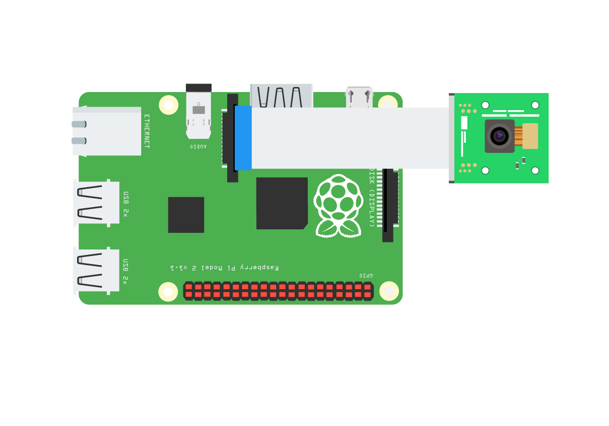

# Pi Camera com Raspberry PI

## Artigos

Pi Camera

* [Documentation](https://picamera.readthedocs.io/en/release-1.13/)
* [Getting started with picamera](https://projects.raspberrypi.org/en/projects/getting-started-with-picamera)
* [Accessing the Raspberry Pi Camera with OpenCV and Python](https://www.pyimagesearch.com/2015/03/30/accessing-the-raspberry-pi-camera-with-opencv-and-python/)

Reconhecimento de Digitos ([MNIST](https://en.wikipedia.org/wiki/MNIST_database))

* [AI Digit Recognition with PiCamera (hackster.io)](https://www.hackster.io/dhq/ai-digit-recognition-with-picamera-2c017f)
* [Layman installation guide for Keras and Tensorflow on RPi 3(medium.com)](https://medium.com/@paroskwan/layman-installation-guide-for-keras-and-tensorflow-on-rpi-3-38b84f3e59dc)

Leitor de Código de Barras com o pacote ZBar

* [Tutorial de introdução ao ZBar](https://github.com/lsmanoel/PythonCodes/blob/master/zbar/barcode_zbar.ipynb)

[Voltar](https://lpae.github.io/)