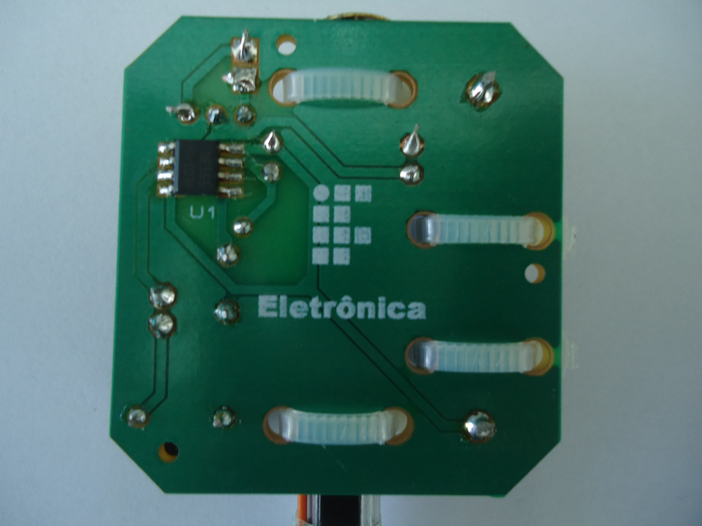

# OFICINA DE SOLDA - DRAWDIO

DRAWDIO é um dispositivo que permite fazer música utilizando apenas papel e lápis. Este dispositivo é licenciado através da Creative Commons (CC BY-SA 3.0). 

Seu esquemático, croqui de montagem e modo de funcionamento são ilustrados na figura abaixo. Ele é composto por um circuito eletrônico que gera diferentes frequências, criando assim diversos tons musicai. O principal componente eletrônico utilizado no DRAWDIO e responsável pela geração destas frequências variadas é o circuito integrado 555. O esquemático do circuito está representado na figura abaixo. O circuito integrado 555 foi configurado para atuar como um multivibrador astável, utilizando para a  modulação da frequência a resistência variável formada entre o grafite do lápis e o corpo da pessoa que desenha. Então, quando é realizado um desenho no papel, as variações de pressão e espessura dos traços provocam variações na frequência do sinal elétrico de saída do circuito integrado 555, gerando também variações no som (em um alto-falante) e criando assim notas musicais. Foi utilizado um lápis com grafite 6B para a montagem deste dispositivo, pelo fato de apresentar propriedades de dureza inferiores aos HB e consequentemente promover uma maior condução no desenho (deposição de uma maior quantidade de grafite no papel). 

Para o correto funcionamento do DRAWDIO, é necessário que o corpo do usuário do dispositivo seja a passagem de corrente elétrica (corrente elétrica na ordem de 2 μA). Assim, é necessário manter um de seus dedos em uma parte do desenho e o lápis em outra parte, completando a então a condução necessária. 

---

**Protótipo da Oficina de Solda**

No Instituto Federal de Santa Catarina - campus Florianópolis foram realizadas oficinas de solda para alunos das escolas do ensino fundamental e médio da grande Florianópolis, em que na prática puderam aprender as técnicas básica de soldagem em placa de circuito impresso, em especial no circuito do DRAWDIO, e puderam levar o protótipo construído na oficina para sua casa.

As imagem abaixo mostram o protótipo devidamente montado.

---

Para ter acesso ao site que originou o projeto clique no [link ](https://drawdio.com/)

Para ter acesso ao *banner* do projeto clique no [link](.\artigo\banner_solda.pdf)

Para ter acesso ao *folder* do projeto clique no [link](.\artigo\folder_de_solda.pdf)

Para ter acesso ao artigo publicado na Revista Ilha Digita clique no [link](http://ilhadigital.florianopolis.ifsc.edu.br/index.php/ilhadigital/article/view/47)

---

Instituto Federal de Educação, Ciência e Tecnologia de Santa Catarina - IF-SC - Campus Florianópolis

Contato:
fernando.miranda@ifsc.edu.br

-[Licença](./license)

---
[Voltar](./../)

[Home](https://lpae.github.io/)

