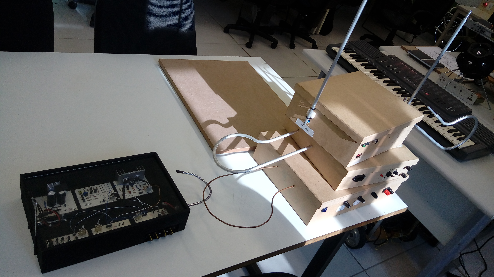

# Repositório do [Projeto Theremin](https://github.com/LPAE/lpae.github.io/tree/master/estudos/Theremin)

O Theremin é um instrumento musical criado na década de 1920 pelo físico russo Lev Sergeyevich Termen, conhecido nos Estados Unidos da América como Léon Theremin. Esse instrumento é composto por circuitos eletrônicos, responsáveis por gerar sinais elétricos convertidos para um alto-falante. Não há contato físico entre o instrumentista e o Theremin. O instrumento é controlado pela proximidade das mãos que altera a frequência e volume do som. 

[Artigo do Projeto](.\pdf\theremin.pdf)

---
[Voltar](./../index.md)
[Home](https://lpae.github.io/)

