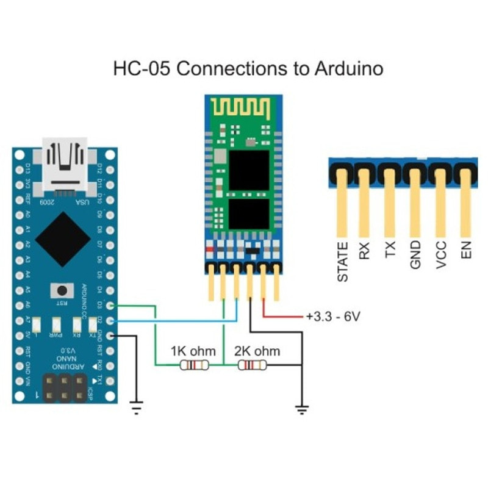

# HC-05

* [Como usar o Arduino Bluetooth HC-05 em modo mestre](https://www.filipeflop.com/blog/tutorial-arduino-bluetooth-hc-05-mestre/)
* [Comunicação entre Módulos Bluetooth HC-05 e HC-06](https://www.embarcados.com.br/modulos-bluetooth-hc-05-e-hc-06/)
* [Bluetooth HC-05: Configurando via Arduino](https://www.robocore.net/tutoriais/configurando-bluetooth-hc-05-via-arduino)

---
[Voltar](./../)

[Home](https://lpae.github.io/)