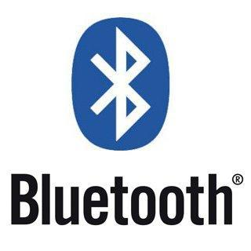

# Bluetooth

Segundo o blog [eletrogate.com](https://blog.eletrogate.com/modulos-bluetooth-hc05-e-hc06-para-comunicacao-com-dispositivos-moveis-com-arduino/), a tecnologia Bluetooth consiste em um protocolo para comunicação de rádio para uso pessoal, isto é, é uma especificação de rede sem fio classificada como PAN (Personal Area Network). Foi desenvolvida inicialmente em 1994 pela Ericsson como uma alternativa sem fio ao protocolo RS-232. A faixa de frequência utilizada pelo Bluetooth é de 2.4 a 2.485 GHz.

## Módulos:

* [Módulo HC-05](./hc_05.md)

---
[Voltar](./../)

[Home](https://lpae.github.io/)

