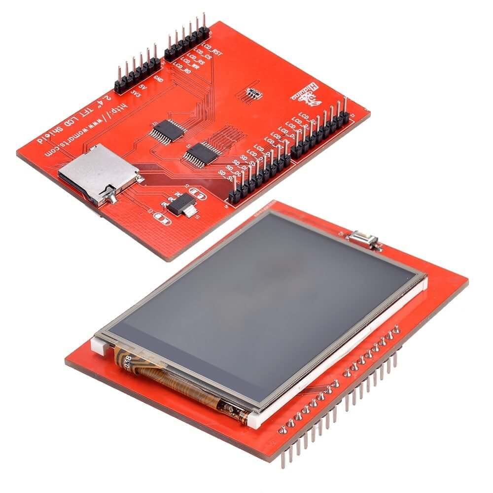

# Display gráfico 2.4 "TFT - ILI9341

* [Primeiros passos shield lcd tft 24 touchscreen](https://portal.vidadesilicio.com.br/primeiros-passos-shield-lcd-tft-24-touchscreen/)
* [3 projetos incríveis com o Display Touch Arduino Shield](https://www.filipeflop.com/blog/display-touch-arduino-shield/)

---
[Voltar](./../)

[Home](https://lpae.github.io/)