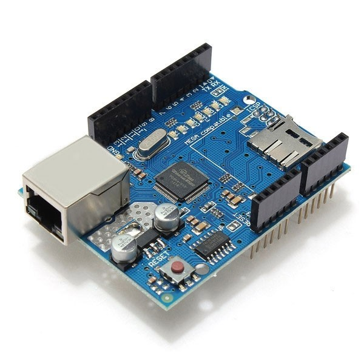

# Ethernet Shield W5100 para Arduino

* [Como comunicar com o Arduino Ethernet Shield W5100 ](https://www.filipeflop.com/blog/tutorial-ethernet-shield-w5100/)
* [Ethernet Shield W5100 como **web server**](http://blogmasterwalkershop.com.br/arduino/arduino-utilizando-o-ethernet-shield-w5100-via-web-server/)

---
[Voltar](./../)

[Home](https://lpae.github.io/)