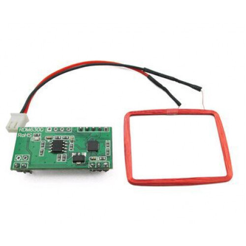

# Leitor RFID RDM6300 125KHz

* [Módulo Leitor RFID RDM6300 e Arduino](https://www.arduinoecia.com.br/leitor-rfid-rdm6300-125khz-arduino/)
* [Arduino Tutorials – RFID (instructables.com)](https://www.instructables.com/id/Arduino-Tutorials-RFID/)

---
[Voltar](./../index.md)

[Home](https://lpae.github.io/)