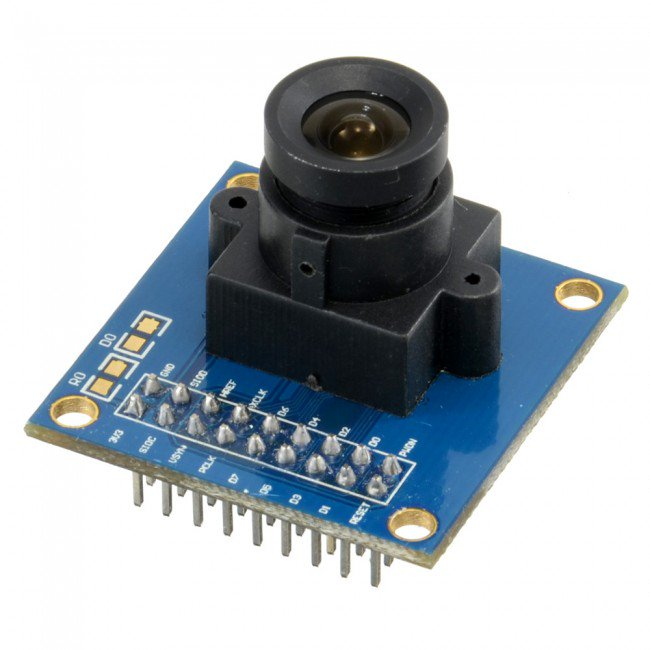

# ov7670

## Datasheet

* [OV7670/OV7171 CMOS VGA (640x480) CAMERA CHIP](https://www.voti.nl/docs/OV7670.pdf)

## Artigos:

* [Sobre a interface SCCB (embarcados.com.br)](https://www.embarcados.com.br/modulo-ov7670-fifo-interface-sccb/)
* [Explorando o módulo OV7670-FIFO: Video Frame Buffer (embarcados.com.br)](https://www.embarcados.com.br/modulo-ov7670-fifo-video-frame-buffer/)
* [Módulo câmera VGA OV7670 (FilipeFlop)](https://www.filipeflop.com/blog/modulo-camera-vga-ov7670/)
* [Arduino Camera (OV7670) Tutorial (sem buffer FIFO) (teachmemicro.com)](https://www.teachmemicro.com/arduino-camera-ov7670-tutorial/)

---
[Voltar](./../)

[Home](https://lpae.github.io/)
