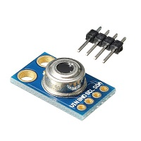
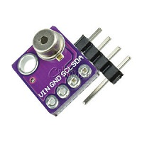

# Nota Técnica Sensor Temperatura Infravermelho


## Sensores

* MLX90614:



* MLX90615:



## Instalação

É possível utilizar qualquer biblioteca compatível com os respectivos sensores.

As bibliotecas testadas e sugeridas são:

- MLX90614: https://github.com/adafruit/Adafruit-MLX90614-Library

- MLX90615: https://github.com/Seeed-Studio/Digital_Infrared_Temperature_Sensor_MLX90615

Para instalar o projeto no Arduino é preciso baixar o projeto do Github como ZIP e após isso, no Arduino, selecionar o arquivo baixado usando Sketch > Include Library > Add .ZIP Library.

Após isso é possível carregar o exmplo para testes em:

- MLX90614: File > Examples > Adafruit MLX90615 Library > mlxtest.

- MLX90615: File > Examples > Digital Infrared Temperature Sensor MLX90615 > singleDevice.

  

## Conexão

#### MLX90614

Para este sensor é utilizado a biblioteca interna "Wire" do Arduino e, portanto, os pinos SDA e SCL são previamente definidos como:

* SCL: A5

* SDA: A4

É necessário inicializar as classes essenciais para o funcionamento do sensor. Um exemplo de inicialização, utilizada no arquivo exemplo é a seguinte: 

```c++
#include <Wire.h>
#include <Adafruit_MLX90614.h>

Adafruit_MLX90614 mlx = Adafruit_MLX90614();
```

Após isso é necessário inicializar o sensor utilizando `mlx.begin()`.

Utlizar a função `mlx.readObjectTempC()` que retorna a temperatura lida do sensor em graus Celsius. Ou Utlizar a função `mlx.readAmbientTempC()` que retorna a temperatura ambiente lida do sensor em graus Celsius. 

**ATENÇÃO**: Alimentação do sensor é 3.3V.


#### MLX90615 

É possível utilizar qualquer pino para a conexão com o sensor. Apenas é necessário inicializar as classes essenciais para o funcionamento do sensor. Um exemplo de inicialização, utilizada no arquivo exemplo é a seguinte: 

```c++
#include "MLX90615.h"
#include <I2cMaster.h>

#define SDA_PIN 3   //define the SDA pin
#define SCL_PIN 2   //define the SCL pin

SoftI2cMaster i2c(SDA_PIN, SCL_PIN);
MLX90615 mlx90615(DEVICE_ADDR, &i2c);
```

**ATENÇÃO**: Alimentação do sensor é 3.3V.

Após isso utlizar a função mlx90615.getTemperature() que retorna a temperatura lida do sensor. Como argumento da função utilizar:

* MLX90615_OBJECT_TEMPERATURE para obter a temperatura de um obejeto.

* MLX90615_AMBIENT_TEMPERATURE para obter a temperatura ambiente.

  

## Teste

A seguir um teste utilizando o sensor de temperatura e um temômetro pistola à laser:

|  Distância do sensor   |  5 cm   | 10 cm  |  5 cm   |  10 m  |
| :--------------------: | :-----: | :----: | :-----: | :----: |
|                        | Pistola | Sensor | Pistola | Sensor |
|  Fonte de Computador   |  41.6   |   36   |   39    |   33   |
|    Xíxara com café     |   47    |   40   |   46    |   33   |
| Água fria do bebedouro |   16    |  22.5  |  17.5   |   26   |
|          Gelo          |   0.5   |  8.4   |    1    |   19   |

[Voltar](https://lpae.github.io/)