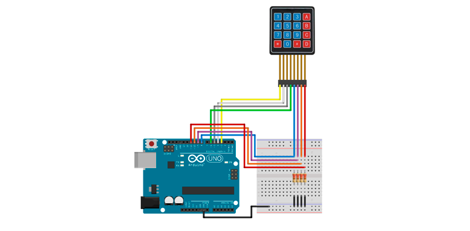
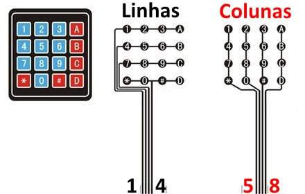

# Teclado Matricial de Membrana 16 Teclas

Este Teclado Matricial 4×4 é um componente do Arduino muito utilizado para entrada de dados. Ele possui 16 teclas dispostas em 4 linhas x 4 colunas, e um conector de 8 pinos para ligação.

* [Como usar o Teclado Matricial 4×4 com Arduino](https://www.filipeflop.com/blog/teclado-matricial-4x4-arduino/)

---
[Voltar](./../)

[Home](https://lpae.github.io/)