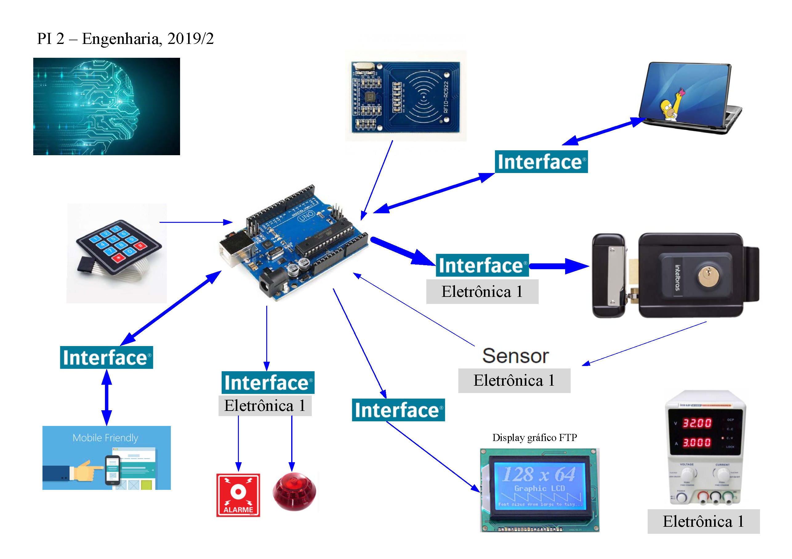

# pi2\_eng\_19\_2

# [Link do Repositório](https://github.com/LPAE/pi2_eng_19_2)

O projeto Integrador 2 nesse semestre consiste no desenvolvimento de um sistema de controle de acesso à ambientes através de RFID e outras tecnologias.

---
[Voltar](https://lpae.github.io/)

