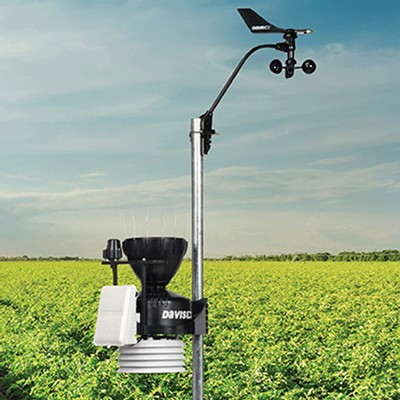
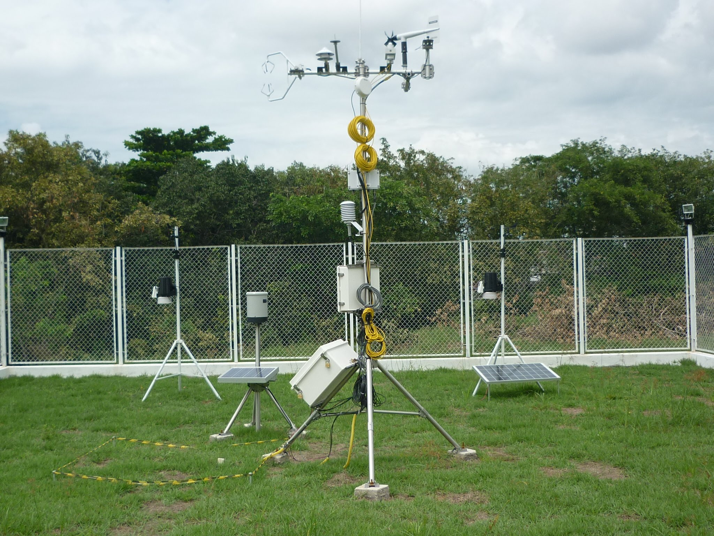

# pi2\_eng\_20\_1

# [Link do Repositório](https://github.com/LPAE/pi2_eng_20_1)

O projeto Integrador 2 nesse semestre consiste no desenvolvimento de um sistema de monitoramento ambiental.

---
[Voltar](./../)

[Home](https://lpae.github.io/)

