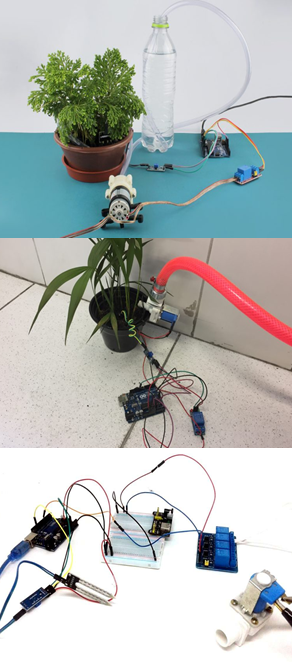
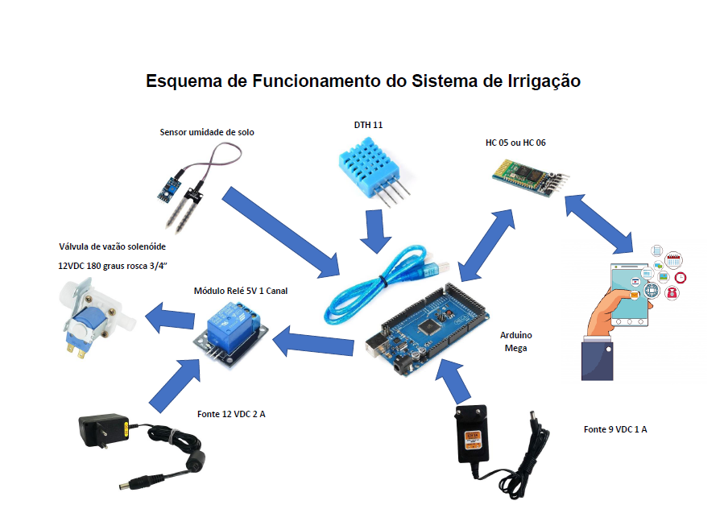

# pi2\_eng\_20\_1

# [Link do Repositório](https://github.com/LPAE/pi2_eng_20_1)

**Proposta para as Atividades Não Presenciais**

A nova proposta para o projeto integrador, levando em consideração as pandemia de COVID-19, é a elaboração de um sistema de irrigação automatizada.

[Voltar](./../)

[Home](https://lpae.github.io/)

