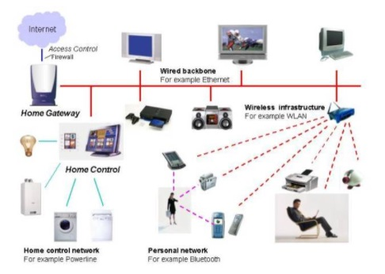

# Projeto Integrador II - 2022-1

## [Link do Repositório](https://github.com/LPAE/pi2_eng_22_1)

---

**Domótica**

 A automação residencial é o controle automático de dispositivos eletrônicos em sua casa. Esses dispositivos estão conectados à Internet, o que permite que sejam controlados remotamente. Com a automação residencial, os dispositivos podem acionar uns aos outros para que você não precise controlá-los manualmente por meio de um aplicativo ou assistente de voz. Por exemplo, você pode colocar as luzes nos horários para que eles desliguem quando você normalmente vai dormir, ou você pode fazer com que o seu termostato ligue o A/C cerca de uma hora antes de voltar ao trabalho para que você não precise voltar para uma casa abafada. A automação residencial torna a vida mais conveniente e pode até economizar dinheiro em contas de aquecimento, resfriamento e eletricidade. A automação residencial também pode levar a uma maior segurança com dispositivos da Internet das Coisas, como câmeras e sistemas de  segurança.

------------------------------------------

[Voltar](./../)

[Home](https://lpae.github.io/)
