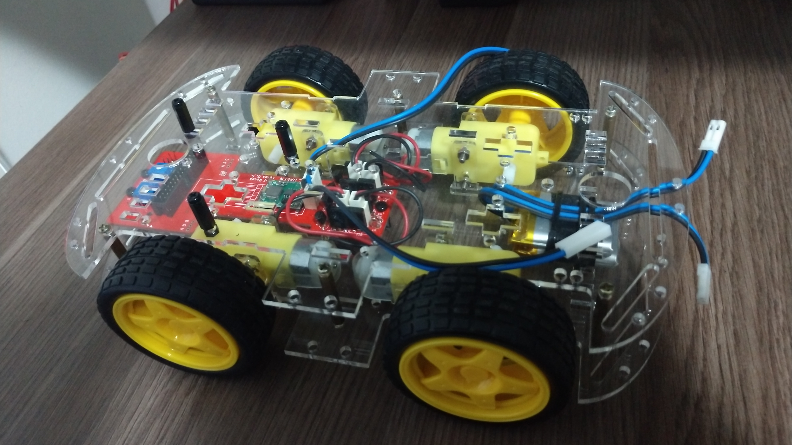

# Projeto Integrador II - 2022-2

## [Link do Repositório](https://github.com/LPAE/pi2_eng_22_2)

---

**Veículo Autônomo**

Neste semestre o tema do Projeto Integrador 2 é o Controle de um Veículo Autônomo. Os seguintes objetivos foram propostos utilizando a metodologia CDIO: 
- Controlar o movimento do veículo utilizando a tecnologia Bluetooth, mediante um telefone celular.
- Incrementar o sistema de controle do veículo com a tecnologia Tracking Module para, de forma autônoma, seguir uma determinada trajetória.
- Agregar ao sistema de controle do veículo a tecnologia Ultrasonic HC-SR04 para desviar de obstáculos, em sua trajetória.
- O sistema de controle é implementado utilizando o framework Arduino com um conjunto de [shields](https://github.com/xtarke/automated_buggy/tree/master/arduino), placa de potência e [classes](https://github.com/xtarke/automated_buggy/tree/master/arduino/buggy).

## [Repositório base do veículo](https://github.com/xtarke/automated_buggy)

------------------------------------------

[Voltar](./../)

[Home](https://lpae.github.io/)
