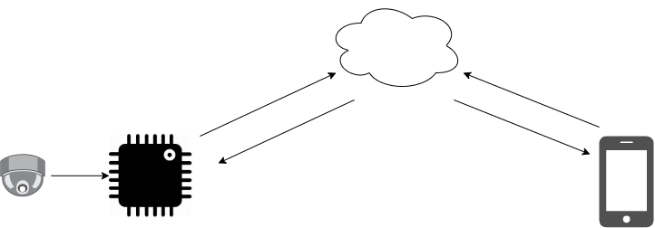

# pi3\_eng\_20\_1 

Estacionamento Inteligente - aluna Marieli Matos

A proposta da aluna Marieli Matos para o Projeto Integrador 3 da Engenharia Eletrônica foi o desenvolvimento de um estacionamento inteligente. Para acessar o trabalho dela, clique no link do repositório.

# [Link do Repositório](https://github.com/LPAE/pi3_eng_20_1)

---
[Voltar](./../)

[Home](https://lpae.github.io/)